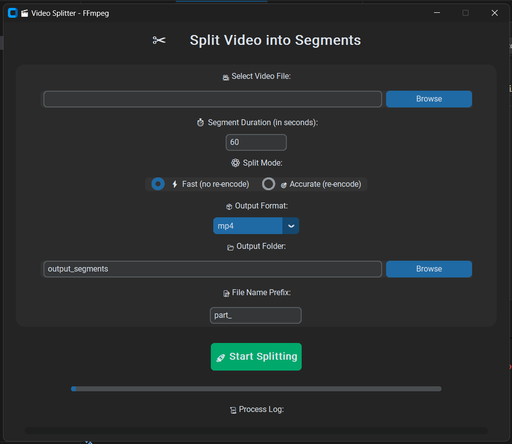

# 🎬 Video Splitter Pro (FFmpeg + Python)

A modern desktop application built with **Python** and **CustomTkinter** that allows you to split large video files into smaller segments efficiently using **FFmpeg**.

---

## ✨ Features

- ⚡ **Fast Mode** — Split videos instantly without re-encoding (lossless).
- 🎯 **Accurate Mode** — Re-encode videos for exact frame splitting.
- 🧩 **Custom Duration** — Set any duration per segment.
- 📝 **Custom Prefix** — Name your output files with a chosen prefix.
- 💾 **Multiple Formats** — Export in MP4, MKV, MOV, or AVI.
- 🪶 **Modern UI** — Beautiful and dark-themed interface using `CustomTkinter`.
- 🧠 **Built-in Log Window** — View FFmpeg process output in real-time.

---

## 🛠️ Requirements

- Python **3.8+**
- FFmpeg installed and added to your system PATH  
  👉 [Download FFmpeg](https://ffmpeg.org/download.html)

---

## 📦 Installation

Clone the repository:

```bash
git clone https://github.com/abduljaleel-alwli/video-splitter.git
cd video-splitter
````

Install dependencies:

```bash
pip install -r requirements.txt
```

---

## 🚀 Usage

Run the app:

```bash
python split_video_ui.py
```

1. Select a video file 🎥
2. Set the segment duration (in seconds) ⏱
3. Choose mode:

   * **Fast (copy)** → Quick split, no re-encoding
   * **Accurate (re-encode)** → Slower but precise
4. Choose format and output folder
5. Click **Start Splitting** 🚀
6. The output segments will appear in your chosen folder.

---

## 🖼 Preview



---

## 📁 Project Structure

```
video-splitter-pro/
│
├── split_video_ui.py
├── requirements.txt
├── README.md
└── assets/
    └── screenshot.png
```

---

## 🤝 Contributing

Pull requests are welcome!
If you encounter any issues or have ideas for improvements, feel free to open an issue.
